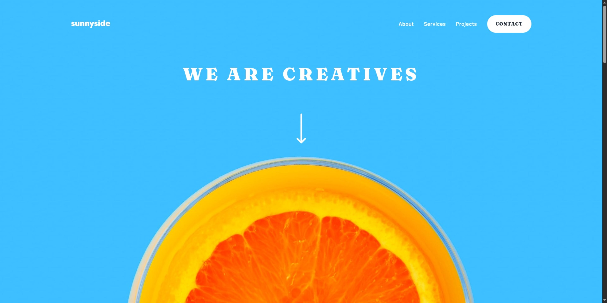

# Frontend Mentor - Sunnyside agency landing page solution

This is a solution to the [Sunnyside agency landing page challenge on Frontend Mentor](https://www.frontendmentor.io/challenges/agency-landing-page-7yVs3B6ef). Frontend Mentor challenges help you improve your coding skills by building realistic projects.

## Table of contents

- [Frontend Mentor - Sunnyside agency landing page solution](#frontend-mentor---sunnyside-agency-landing-page-solution)
  - [Table of contents](#table-of-contents)
  - [Overview](#overview)
    - [The challenge](#the-challenge)
    - [Screenshot](#screenshot)
    - [Links](#links)
  - [My process](#my-process)
    - [Built with](#built-with)
    - [What I learned](#what-i-learned)
    - [Continued development](#continued-development)
    - [Useful resources](#useful-resources)
    - [AI Collaboration](#ai-collaboration)
  - [Author](#author)
  - [Acknowledgments](#acknowledgments)

## Overview

### The challenge

Users should be able to:

- View the optimal layout for the site depending on their device's screen size
- See hover states for all interactive elements on the page
- Navigate the mobile menu with keyboard and screen reader support
- Experience smooth animations and transitions

### Screenshot



### Links

- Solution URL: [GitHub](https://github.com/runny-life/sunnyside-agency-landing-page)
- Live Site URL: [GitHub Pages](https://github.com/runny-life/sunnyside-agency-landing-page)

## My process

### Built with

- Semantic HTML5 markup
- CSS custom properties
- Flexbox
- CSS Grid
- Mobile-first workflow
- [Tailwind CSS](https://tailwindcss.com/) - Utility-first CSS framework
- Vanilla JavaScript for interactivity
- WebP/AVIF responsive images with `<picture>` element
- ARIA attributes for accessibility
- Reduced motion preferences

### What I learned

This project was an excellent opportunity to practice responsive design with a mobile-first approach using Tailwind CSS. Some key learnings include:

**1. Custom Properties in Tailwind CSS**

Created a comprehensive design system using Tailwind's `@theme` directive:

```css
@theme {
  --color-red-400: #fe7766;
  --text-preset-1: 3.5rem;
  --text-preset-1--line-height: 1.25;
  --text-preset-1--letter-spacing: 0.16em;
  --text-preset-1--font-weight: 900;
}
```

**2. Custom Utility Classes**

Created reusable utility classes for consistent styling patterns:

```css
@utility button-decoration-line-1 {
  @apply before:content-[''] before:absolute before:w-[calc(100%+8px*2)] before:h-2.5 before:bg-yellow-500/25 before:left-[50%] before:translate-x-[-50%] before:bottom-[15%] before:rounded-[28px] hover:before:bg-yellow-500 before:transition-colors before:duration-300 before:-z-10;
}
```

**3. Accessible Mobile Menu**

Built an accessible mobile navigation using the `<dialog>` element with proper ARIA attributes:

```javascript
const dialog = document.querySelector("#main-navigation");
const toggleButton = document.querySelector("#menu-toggle");

toggleButton.addEventListener("click", () => {
  if (dialog.open) {
    dialog.close();
    toggleButton.focus();
    toggleButton.setAttribute("aria-expanded", "false");
  } else {
    dialog.show();
    toggleButton.setAttribute("aria-expanded", "true");
  }
});
```

**4. Reduced Motion Support**

Added support for users who prefer reduced motion:

```css
@media (prefers-reduced-motion: reduce) {
  *,
  *::before,
  *::after {
    animation-duration: 0.01ms !important;
    animation-iteration-count: 1 !important;
    transition-duration: 0.01ms !important;
  }
}
```

**5. Responsive Images with Art Direction**

Used `<picture>` elements to serve different images based on viewport:

```html
<picture>
  <source
    media="(min-width: 1024px)"
    srcset="./src/assets/images/desktop/image-transform.jpg"
  />
  
</picture>
```

### Continued development

In future projects, I want to focus on:

- **Performance Optimization**: Implementing image optimization techniques like using WebP/AVIF formats with proper fallbacks
- **Advanced Animations**: Using CSS animations and transitions more effectively while respecting reduced motion preferences
- **Form Validation**: Adding proper form validation for the contact section
- **Testing**: Implementing unit and integration tests for the interactive components
- **SEO**: Improving semantic HTML structure and metadata

### Useful resources

- [Tailwind CSS Documentation](https://tailwindcss.com/docs) - Excellent resource for understanding Tailwind's utility classes and customization
- [MDN Web Docs - Dialog Element](https://developer.mozilla.org/en-US/docs/Web/HTML/Element/dialog) - Helped implement the accessible mobile menu
- [CSS-Tricks - A Complete Guide to Grid](https://css-tricks.com/snippets/css/complete-guide-grid/) - Used extensively for the responsive layout
- [Frontend Mentor - Accessibility Guide](https://www.frontendmentor.io/accessibility) - Helped ensure proper ARIA implementation

### AI Collaboration

During this project, I used AI tools to enhance my development process:

**Tools Used:**

- Claude AI (Anthropic)

**How I Used AI:**

- **Code Review**: The AI helped review my HTML structure and suggested improvements for accessibility, such as proper ARIA attributes and semantic HTML elements
- **Debugging**: Assisted in troubleshooting issues with the mobile menu implementation, particularly with dialog behavior and focus management
- **CSS Optimization**: Helped refactor some CSS classes to be more maintainable and reusable
- **Best Practices**: Provided guidance on responsive design patterns and Tailwind CSS best practices

**What Worked Well:**

- The AI's suggestions for accessibility improvements were particularly valuable, helping me implement proper ARIA labels and keyboard navigation
- The quick feedback on code structure helped maintain clean, organized code
- AI-assisted problem solving for the mobile menu logic saved debugging time

**Challenges:**

- Some AI suggestions needed manual adjustment to fit the project's specific design requirements
- Had to verify AI recommendations against official documentation to ensure best practices

## Author

- GitHub - [@runny-life](https://github.com/runny-life)
- Frontend Mentor - [@runny-life](https://www.frontendmentor.io/profile/runny-life)

## Acknowledgments

Special thanks to the Frontend Mentor community for providing challenging projects that help developers grow. The design inspiration and assets provided by Frontend Mentor were instrumental in creating this landing page.

The accessibility guidelines and best practices from the web development community helped ensure this project is inclusive and usable for everyone.
